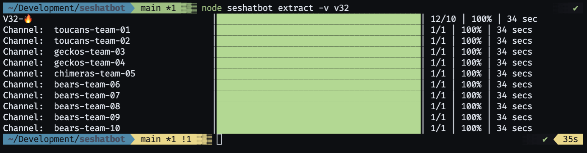

[contributors-shield]: https://img.shields.io/github/contributors/chingu-x/seshatbot.svg?style=for-the-badge
[contributors-url]: https://github.com/chingu-x/seshatbot/graphs/contributors
[forks-shield]: https://img.shields.io/github/forks/chingu-x/seshatbot.svg?style=for-the-badge
[forks-url]: https://github.com/chingu-x/seshatbot/network/members
[stars-shield]: https://img.shields.io/github/stars/chingu-x/seshatbot.svg?style=for-the-badge
[stars-url]: https://github.com/chingu-x/seshatbot/stargazers
[issues-shield]: https://img.shields.io/github/issues/chingu-x/seshatbot.svg?style=for-the-badge
[issues-url]: https://github.com/chingu-x/seshatbot/issues

[![Contributors][contributors-shield]][contributors-url]
[![Forks][forks-shield]][forks-url]
[![Stargazers][stars-shield]][stars-url]
[![Issues][issues-shield]][issues-url]



## Seshatbot

Seshatbot collects metrics Chingu uses to monitor the effectiveness & progress
of our programs. This data is extracted from multiple data sources including
our Discord community, as well as our GitHub repos.

[Seshat](https://en.wikipedia.org/wiki/Seshat) is the ancient Egyptian goddess of wisdom, knowledge, and writing.

- [Process Overview](#process-overview) 
- [Installation](#installation) 
- [Usage](#usage) 
- [Release History](#release-history) 
- [License](#license)
## Process Overview

Seshatbot does the following to build metrics for a particular Voyage:

At this time Seshabot only extracts message counts from each Discord team channel:
1. Create a list of the team channels to be processed
2. Count the number of messages for each team member in each team channel
3. Retrieve all messages in the channel. Start by creating a template entry for 
each sprint for the current team that will be updated as incoming messages are 
tallied.
4. Add or update matching rows in the `Voyage Metrics` table in Airtable

## Installation

To install this app:
```
git clone https://github.com/chingu-x/seshatbot.git
npm i
```

To run the app check out the information in the *_'Usage'_* section below.

Seshatbot must be defined in the Discord server and granted administrator
permissions. 
## Usage

Uhurubot is a command line application (CLI). The basic command to run it is:
```
node sheshatbot <command> <command-argument> <options>
```
| Command/Argument | Description                       | Permissable options |
|------------|-----------------------------------------|---------------------|
| extract    | Extract metrics from a source:          |                     |
| ..discord  | ..extract Discord team channel metrics  | -v, -c, -t -c                  |
| ..website  | ..extract Google Analytics metrics for chingu.io |            |


Before running it you'll first need to identify option values you'll using 
in both the command line and the CLI `.env` file. 

| CLI Flag        | `.env` Parm    | Description                              |
|-----------------|----------------|------------------------------------------|
| N/a             | GUILD_ID       | Discord guild id (e.g. `330999646284448021`) |
| N/a             | DISCORD_TOKEN  | Discord private API key (e.g. `ABCk0MM4nmgwNET5MDc4ABC9`) 
| N/a             | AIRTABLE_API_KEY | Airtable API private key (e.g. `key8r4bSGxmay55bo`) |
| N/a             | AIRTABLE_BASE  | Airtable base id (e.g. `appceLf5lkdjwXUO9FU`) |
| -v, --voyage    | VOYAGE         | Voyage name (e.g. "v32")                 |
| -t, --category  | CATEGORY       | Regex to match the Discord category name (e.g. `V\d{2}-🔥$)` |
| -c, --channel   | CHANNEL        | Regex to match the Discord team channel name within the category (e.g. `[a-z]+-team-\d{2}$)` |
 
It's important to keep in mind that options you supply on the command line
ALWAYS override the same option you specify in the `.env` file.

`env.sample` in the root of the project contains a sample of how to set up a `.env` file.

### CLI Examples

#### Example #1 - Extract Discord Team Channel Metrics

In a terminal session issue the following to extract metrics for Discord team 
channel metrics in a specific voyage: 
```
node seshabot extract discord -v v32
```

After completion the `Voyage Metrics` table in Airtable will contain one row
for each team member in the specified Voyage, tallying the number of messages
that person has posted to their team channel in each sprint.

## Release History

You can find what changed, when in the [release history](./docs/RELEASE_HISTORY.md)

## License

Copyright 2023 &copy; Chingu, Inc.

Redistribution and use in source and binary forms, with or without modification, are permitted provided that the following conditions are met:

1. Redistributions of source code must retain the above copyright notice, this list of conditions and the following disclaimer.

2. Redistributions in binary form must reproduce the above copyright notice, this list of conditions and the following disclaimer in the documentation and/or other materials provided with the distribution.

3. Neither the name of the copyright holder nor the names of its contributors may be used to endorse or promote products derived from this software without specific prior written permission.

THIS SOFTWARE IS PROVIDED BY THE COPYRIGHT HOLDERS AND CONTRIBUTORS "AS IS" AND ANY EXPRESS OR IMPLIED WARRANTIES, INCLUDING, BUT NOT LIMITED TO, THE IMPLIED WARRANTIES OF MERCHANTABILITY AND FITNESS FOR A PARTICULAR PURPOSE ARE DISCLAIMED. IN NO EVENT SHALL THE COPYRIGHT HOLDER OR CONTRIBUTORS BE LIABLE FOR ANY DIRECT, INDIRECT, INCIDENTAL, SPECIAL, EXEMPLARY, OR CONSEQUENTIAL DAMAGES (INCLUDING, BUT NOT LIMITED TO, PROCUREMENT OF SUBSTITUTE GOODS OR SERVICES; LOSS OF USE, DATA, OR PROFITS; OR BUSINESS INTERRUPTION) HOWEVER CAUSED AND ON ANY THEORY OF LIABILITY, WHETHER IN CONTRACT, STRICT LIABILITY, OR TORT (INCLUDING NEGLIGENCE OR OTHERWISE) ARISING IN ANY WAY OUT OF THE USE OF THIS SOFTWARE, EVEN IF ADVISED OF THE POSSIBILITY OF SUCH DAMAGE.
